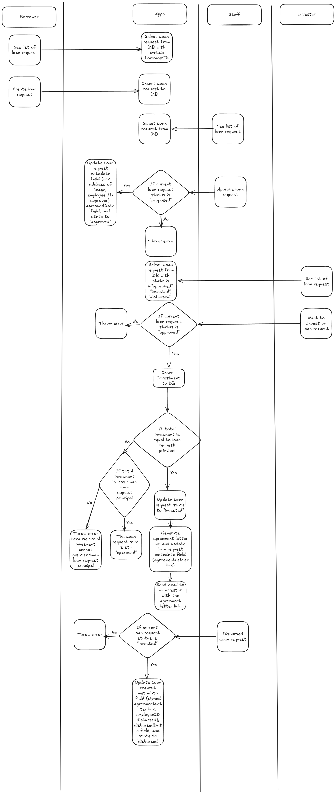

# Loan Service

A Go HTTP service that manages the full lifecycle of loan requests — from proposal through approval, investment, and disbursement.



## Loan Lifecycle

A loan request transitions through four states:

```
Proposed → Approved → Invested → Disbursed
```

| State | Trigger | Description |
|---|---|---|
| **Proposed** | Borrower creates a loan request | Initial state |
| **Approved** | Staff uploads picture proof and approves | Requires proof image (JPEG/PNG/WebP) |
| **Invested** | Investors fund the full principal | Automatically transitions when total investments reach the principal; generates an agreement letter and emails all investors |
| **Disbursed** | Staff uploads signed agreement and disburses | Requires signed agreement file (PDF/JPEG) |

## Project Structure

```
cmd/http/          Entry point – starts the HTTP server on :8080
server/            Dependency wiring (InitDependencies)
server/http/       HTTP mux setup and routing
handler/loan/      HTTP handlers (request parsing, response writing)
usecase/loan/      Business logic, validation, orchestration
domain/
  loan_request/    LoanRequest model, domain interface, in-memory DB
  investment/      Investment model, domain interface, in-memory DB
  storage/         File upload interface (dummy implementation)
  notification/    Email sender interface (dummy implementation)
  document/        Agreement letter generator interface (dummy implementation)
```

## Getting Started

### Prerequisites

- Go 1.21+

### Run

```bash
go run ./cmd/http
```

The server listens on `http://localhost:8080`.

## API Endpoints

### Create Loan Request

```
POST /v1/loan-requests
Content-Type: application/json
```

**Request body:**

```json
{
  "borrower_id": 1,
  "principal": 5000000,
  "rate": 10,
  "roi": 8
}
```

`rate` defaults to `10` and `roi` defaults to `8` if omitted. The loan is created in the `proposed` state.

**Response:** `201 Created`

```json
{
  "id": 1,
  "borrower_id": 1,
  "principal": 5000000,
  "state": "proposed",
  "rate": 10,
  "roi": 8
}
```

---

### List Loan Requests

```
GET /v1/loan-requests?current_user_id=2&role=staff&state=proposed,approved
```

**Query parameters:**

| Parameter | Required | Description |
|---|---|---|
| `current_user_id` | Yes | ID of the requesting user |
| `role` | Yes | One of `borrower`, `investor`, `staff` |
| `state` | No | Comma-separated state filter (`proposed`, `approved`, `invested`, `disbursed`) |

Role-based visibility:
- **borrower** — sees only their own loan requests
- **investor** — sees only `approved`, `invested`, and `disbursed` loans
- **staff** — sees all loan requests

**Response:** `200 OK` — JSON array of loan requests.

---

### Approve Loan Request

```
POST /v1/loan-requests/approve
Content-Type: multipart/form-data
```

**Form fields:**

| Field | Type | Required | Description |
|---|---|---|---|
| `current_user_id` | int | Yes | Staff employee ID |
| `loan_request_id` | int | Yes | Loan request to approve |
| `proof` | file | Yes | Picture proof (JPEG, PNG, or WebP) |

Only loan requests in `proposed` state can be approved.

**Response:** `204 No Content`

---

### Invest in Loan

```
POST /v1/loan-requests/invest
Content-Type: application/json
```

**Request body:**

```json
{
  "current_user_id": 3,
  "loan_request_id": 1,
  "amount": 2500000
}
```

Only `approved` loans accept investments. The total invested amount cannot exceed the loan principal. When the full principal is funded, the loan transitions to `invested`, an agreement letter is generated, and all investors are notified via email.

**Response:** `201 Created`

```json
{
  "id": 1,
  "investor_id": 10,
  "loan_request_id": 1,
  "amount": 2500000
}
```

---

### Disburse Loan

```
POST /v1/loan-requests/disburse
Content-Type: multipart/form-data
```

**Form fields:**

| Field | Type | Required | Description |
|---|---|---|---|
| `current_user_id` | int | Yes | Staff employee ID |
| `loan_request_id` | int | Yes | Loan request to disburse |
| `signed_agreement` | file | Yes | Signed agreement letter (PDF or JPEG) |

Only fully `invested` loans can be disbursed.

**Response:** `204 No Content`

## Architecture

The service follows a layered architecture:

- **Handler** — Parses HTTP requests, delegates to the usecase, and writes HTTP responses.
- **Usecase** — Contains business rules, validation, and orchestrates domain operations (file uploads, email notifications, agreement generation).
- **Domain** — Core entities and repository interfaces. Each domain package owns its model, interface, and data access implementation.

All external dependencies (storage, email, document generation) are defined as interfaces in the domain layer with dummy implementations for demonstration purposes.
